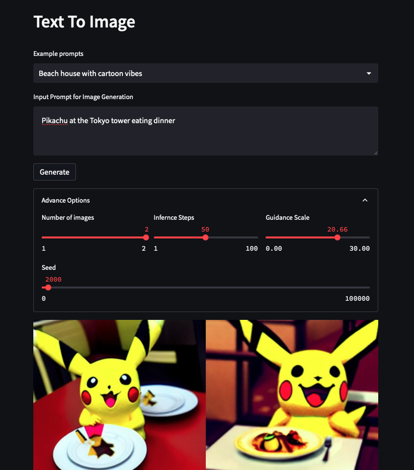
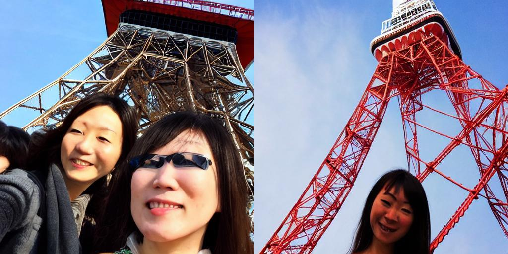

# Intro

Base repo to test out pl and stable diffussion

## How to install
1) Install packages
```bash
pip install -r requirements.txt
```

2) Sign in to the huggingface cli
```bash
huggingface-cli login
```

Note: You will need to sign up for a huggingface account and accept the license to use the diffuser libray


## How to run
### Run as an app with ui
1) Run fastapi first
```
uvicorn api.app:app --host 0.0.0.0
```

2) Run streamlit next
```bash
streamlit run main_ui.py
```

### Run script to generate
```bash
python gen_image.py
```

## Notes
- Using 5GB GPU can still work but must be a higher version of torch

## Example
### Web UI


### Generated image
input: "Tokyo Tower Selfie"


## To Do
- [x] Streamlit webui
- [ ] Image in painting
- [x] Fastapi backened